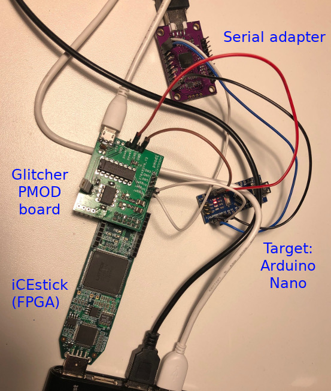
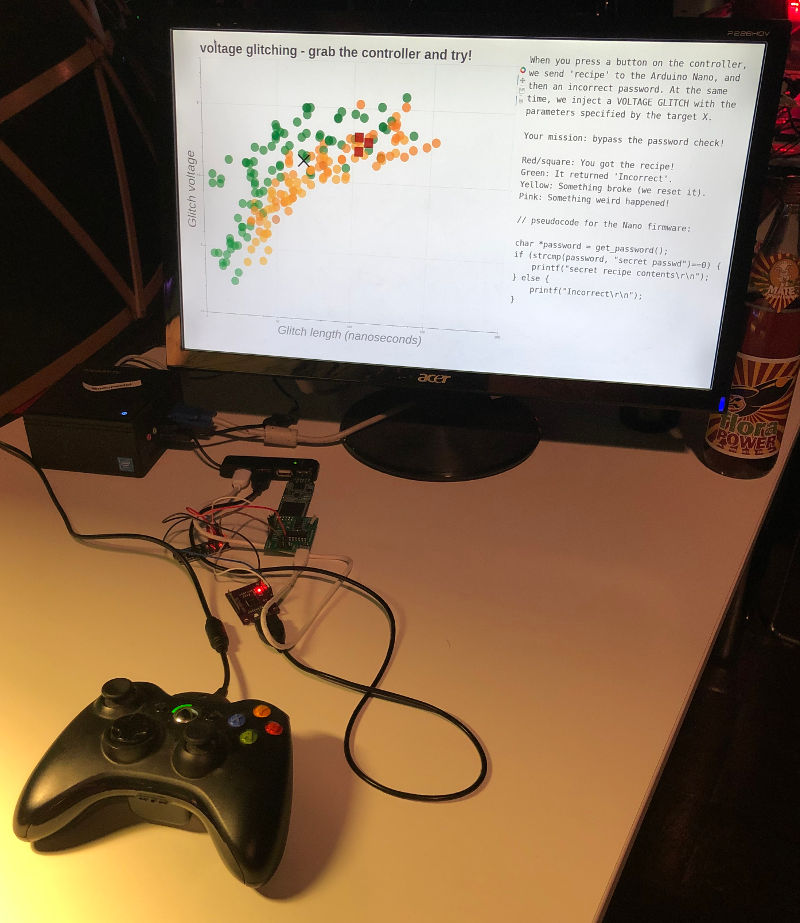

# iceGLITCH

iceGLITCH is a cheap, fun and terrible voltage glitcher!

You can use it to inject faults in the voltage line of targets, making them do weird things.

You can control both the normal and glitch voltage levels, and if you squint and sort of wave your hands a lot, then you can pretend you get ~200ps of resolution for both the glitch delay (time between trigger and glitch) and length (time that the voltage is changed from normal to glitch level).

Come by our 'Hardware Slackers' assembly at 36C3 and see it in person,
and feel free to complain at us about things that don't work.

This is what a typical setup looks like:

And this is an example of what a real-world attack looks like (from our 36C3 assembly):

# Hardware

You can solder a good-enough (fun!) version of this glitcher using protoboard,
but nowadays we use a PCB version (see the 'pcb' directory). You can solder several
different combinations of components to get different glitcher designs, some of which make more
sense than others; however, we guarantee that all combinations will be both terrible and fun.

You can use it with any ICE40HX FPGA board with a PMOD connector; we're using the cheap (~22eur) 'iCEstick'.

# Code

The 'TOE' directory contains code for some example targets.

The FPGA code (to be built using the open source yosys/nextpnr toolchain) is in the 'fpga' directory. We can't write verilog, there are no test cases, it is all terrible. We are sorry, our code is bad and we should feel bad. But it works :D

The (python) scripts are in the 'scripts' directory, including scripts to attack the example targets.

## History/Context

We built a horrible, horrible 5eur "oscilloscope" for our 35C3 side channel analysis workshop:
the [HorrorScope](https://github.com/albert-spruyt/HorrorScope).
This glitcher is our attempt to build a similar cheap-and-cheerful workshop platform for voltage glitching.

Some of our friends used it at the HITB CyberWeek in [October 2019](https://twitter.com/AllOurFaults/status/1184734015699464192), and we "released" it at 36C3 in December 2019.

Thanks to everyone who helped inspire or test our hacks, and thanks to @nedos in particular for making us realize we could
just use a cheap analog switch rather than overcomplicating things!

